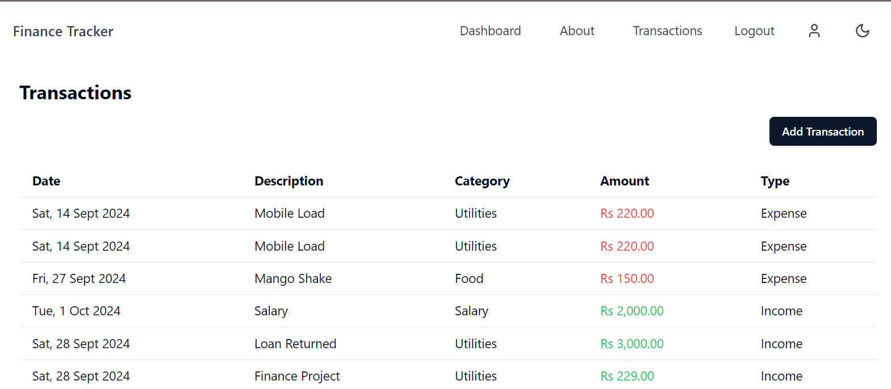

# Personal Finance Tracker Documentation

## Table of Contents

1. [Project Overview](#1-project-overview)
   1. [Visual Overview](#11-visual-overview)
2. [Features](#2-features)
3. [Technologies Used](#3-technologies-used)
4. [Installation and Setup](#4-installation-and-setup)
5. [Usage Instructions](#5-usage-instructions)
6. [Deployment](#6-deployment)
7. [Troubleshooting](#7-troubleshooting)
8. [API Documentation](#8-api-documentation)
9. [Contributing](#9-contributing)
10. [License](#10-license)

## 1. Project Overview

**Personal Finance Tracker** is a web application designed to help users
efficiently manage and track their financial transactions. Users can add income
and expenses, categorize their spending, and visualize it through interactive
graphs. The app aims to improve financial awareness by offering clear insights
into spending habits and trends over time.

## 1.1 Visual Overview



## 2. Features

- Add income/expense
- View transactions
- Track spending through multiple views of graphs (static graphs)
- **User permissions**: Admin users can delete or edit all transactions, while
  regular users can only modify or delete their own entries.

## 3. Technologies Used

- **Frontend**: React, TypeScript, Tailwind CSS
- **Backend**: Node.js, Express, TypeScript
- **Database**: MongoDB

## 4. Installation and Setup

1. **Clone the repository**:

   ```bash
   git clone https://github.com/MHammad33/personal-finance-tracker
   cd personal-finance-tracker
   ```

2. **Install dependencies**:

   - For both frontend and backend, run the following command:

   ```bash
   npm install
   ```

3. **Set up environment variables**:

   - Create a `.env` file in the root directory with the following variables:
     ```bash
      MONGODB_URI=<your-mongodb-uri>   # MongoDB URI for database connection
     PORT=3001                        # Backend server port
     REACT_APP_API_URL=http://localhost:5173  # URL for backend API
     JWT_SECRET=<your-jwt-secret>     # JWT secret for authentication
     ```
     Note: Ensure to replace `<your-mongodb-uri>` with the actual URI string
     from your MongoDB account.

4. **Run the backend server**:

   ```bash
   npm run server
   ```

5. **Run the frontend application**:

   ```bash
   npm run dev
   ```

6. **Open in browser**:
   - Visit `http://localhost:5173` to view the application.

## 5. Usage Instructions

- **User Roles**: There are two types of users in the application:

  - **Admin User**: Can add, edit, or delete all transactions.
  - **Regular User**: Can only add, edit, or delete their own transactions.

- **Add Transactions**: Click the "Add Transactions" button on the transactions
  page, and provide the relevant details. For example:

  - Amount: "100"
  - Description: "Groceries"
  - Type: "Income" or "Expense"
  - Category: "Food"
  - Date: "Oct 16, 2024"

    **Example Usage**:

  - To add an expense for groceries:
    - Amount: `100`
    - Description: `Groceries`
    - Type: `Expense`
    - Category: `Food`
    - Date: `2024-10-16`

- **View Transactions**: Go to the transactions page listed in the navbar to see
  all recorded transactions.

- **Switch Graph Views for Tracking**: Use static graph views in the Dashboard
  to analyze spending over time, categorized by types (income vs. expense) and
  categories (e.g., Food, Transportation).

- **Edit Transactions**: Click on any transaction to edit the details, such as
  changing the amount or category.

- **Delete Transactions**: Use the delete option next to each transaction to
  remove it from your records.

## 6. Deployment

The project is deployed on **Vercel**. You can access it here:
[https://finance-frontend-rust-three.vercel.app/](https://finance-frontend-rust-three.vercel.app/).

## 7. Troubleshooting

- **Issue**: MongoDB connection error
  - **Solution**: Ensure that the `MONGODB_URI` in your `.env` file is correct
    and the MongoDB service is running.
- **Issue**: App not running on `http://localhost:5173`
  - **Solution**: Ensure both the backend (`npm run server`) and frontend
    (`npm run dev`) are running.

## 8. API Documentation

- **POST /api/transactions**: Add a new transaction

  - Request headers:

  ```json
  {
    "Authorization": "Bearer <your-jwt-token>"
  }
  ```

  - Request body:
    ```json
    {
      "type": "expense",
      "amount": 100,
      "category": "Food",
      "description": "Grocery shopping",
      "date": "2024-10-16"
    }
    ```
  - Response:

    ```json
    {
      "userId": "unique_user_id",
      "amount": 100,
      "description": "Groceries",
      "type": "expense",
      "category": "Food",
      "date": "2024-10-16T00:00:00.000Z",
      "createdAt": "2024-10-16T09:28:21.888Z",
      "updatedAt": "2024-10-16T09:28:21.888Z",
      "id": "unique_transaction_id"
    }
    ```

- **GET /api/transactions**: Fetch all transactions

  - Response:
    ```json
    [
      {
        "id": "unique_transaction_id",
        "type": "expense",
        "amount": 100,
        "category": "Food",
        "description": "Grocery shopping",
        "date": "2024-10-16T00:00:00.000Z"
      }
      // ...
    ]
    ```

- **DELETE /api/transactions/:id**: Delete a specific transaction by ID

  - Response:
    ```json
    {
      "message": "Transaction deleted successfully"
    }
    ```

## 9. Contributing

Contributions are welcome! Here's how you can get started:

1. **Fork the repository**: Create a personal copy of the project by forking the
   repository on GitHub.
2. **Create a new branch**: Use the following command to create a new branch for
   your feature:

   ```bash
   git checkout -b feature-branch
   ```

3. Make your changes: Implement your feature or bug fix in the new branch.
4. Commit your changes: Use a clear and descriptive commit message:

   ```bash
   git commit -m 'Add new feature or fix issue'
   ```

5. Push to the branch: Push your changes to your forked repository:

   ```bash
   git push origin feature-branch
   ```

6. Create a pull request: Navigate to the original repository on GitHub and
   click "New Pull Request" to submit your changes for review.

7. Wait for review: Once you submit your pull request, wait for feedback from
   the maintainers. Be prepared to address any comments or suggestions.

8. Merge: After approval, your changes will be merged into the main branch.

### Note for Developers

- Follow standard naming conventions for branches, commits, and variables.
- Make sure your code passes linting checks before submitting a pull request.
- Write concise and clear commit messages to improve code readability.

## 10. License

**All rights reserved**: This project is copyrighted, and all rights are
reserved by the author.
